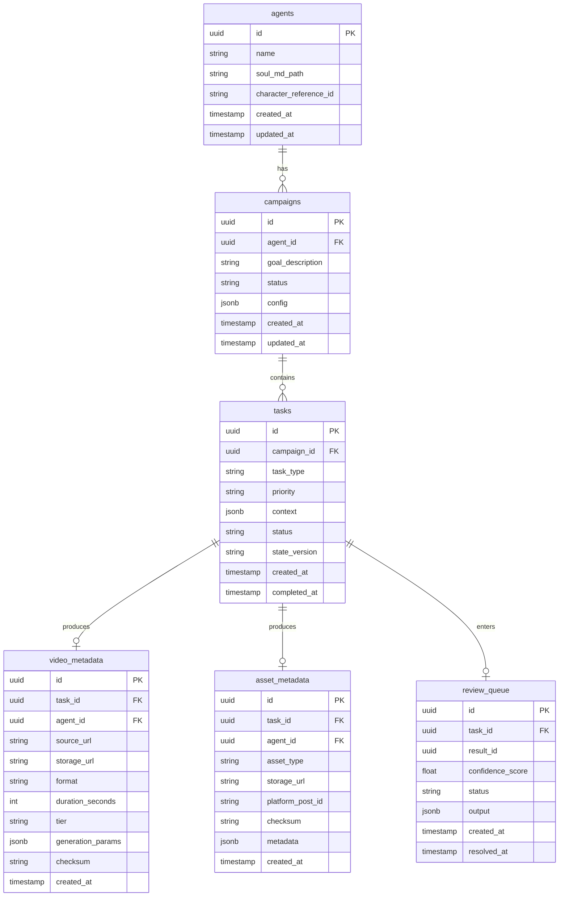

# Project Chimera — Technical Specification

**Version:** 1.0  
**Traceability:** SRS Sections 6.2, Architecture Strategy Section 7

---

## 1. API Contracts

### 1.1 Agent Task (Planner → Worker)

Payload passed from Planner to Worker via the TaskQueue.

```json
{
  "task_id": "uuid-v4-string",
  "task_type": "generate_content | reply_comment | execute_transaction | fetch_trends",
  "priority": "high | medium | low",
  "context": {
    "goal_description": "string",
    "persona_constraints": ["string"],
    "required_resources": ["mcp://twitter/mentions/123", "mcp://memory/recent"],
    "character_reference_id": "string | null",
    "platform": "twitter | instagram | threads | tiktok | null"
  },
  "assigned_worker_id": "string",
  "created_at": "ISO8601 timestamp",
  "status": "pending | in_progress | review | complete",
  "state_version": "string"
}
```

| Field | Type | Required | Description |
|-------|------|----------|-------------|
| `task_id` | UUID | Yes | Unique task identifier |
| `task_type` | enum | Yes | Type of work to perform |
| `priority` | enum | Yes | Affects queue ordering |
| `context` | object | Yes | Goal, constraints, MCP resource URIs |
| `assigned_worker_id` | string | No | Worker instance (if pre-assigned) |
| `created_at` | timestamp | Yes | Task creation time |
| `status` | enum | Yes | Current lifecycle state |
| `state_version` | string | Yes | OCC version for Judge validation |

---

### 1.2 Worker Result (Worker → Judge)

Payload pushed to ReviewQueue after Worker execution.

```json
{
  "result_id": "uuid-v4-string",
  "task_id": "uuid-v4-string",
  "status": "success | failure",
  "confidence_score": 0.0,
  "output": {
    "content_type": "text | image | video | social_post",
    "text_content": "string | null",
    "media_urls": ["string"],
    "platform": "string | null",
    "disclosure_level": "automated | assisted | none"
  },
  "reasoning_trace": "string",
  "state_version": "string",
  "created_at": "ISO8601 timestamp",
  "sensitive_topics_detected": ["string"]
}
```

| Field | Type | Required | Description |
|-------|------|----------|-------------|
| `result_id` | UUID | Yes | Unique result identifier |
| `task_id` | UUID | Yes | Links to originating task |
| `status` | enum | Yes | success or failure |
| `confidence_score` | float | Yes | 0.0–1.0; used for HITL routing |
| `output` | object | Yes | Generated content or action payload |
| `reasoning_trace` | string | No | LLM reasoning for audit |
| `state_version` | string | Yes | Must match at commit time |
| `sensitive_topics_detected` | array | No | Triggers mandatory HITL |

---

### 1.3 MCP Tool: `post_content`

Standard definition for social publishing.

```json
{
  "name": "post_content",
  "description": "Publishes text and media to a connected social platform.",
  "inputSchema": {
    "type": "object",
    "properties": {
      "platform": {
        "type": "string",
        "enum": ["twitter", "instagram", "threads", "tiktok"]
      },
      "text_content": {
        "type": "string",
        "description": "The body of the post/tweet."
      },
      "media_urls": {
        "type": "array",
        "items": { "type": "string" }
      },
      "disclosure_level": {
        "type": "string",
        "enum": ["automated", "assisted", "none"]
      }
    },
    "required": ["platform", "text_content"]
  }
}
```

---

### 1.4 MCP Tool: `generate_image`

```json
{
  "name": "generate_image",
  "description": "Generates an image using the configured MCP image server.",
  "inputSchema": {
    "type": "object",
    "properties": {
      "prompt": { "type": "string" },
      "character_reference_id": { "type": "string" },
      "style": { "type": "string" }
    },
    "required": ["prompt", "character_reference_id"]
  }
}
```

---

### 1.5 MCP Tool: `generate_video`

```json
{
  "name": "generate_video",
  "description": "Generates video via image-to-video or text-to-video.",
  "inputSchema": {
    "type": "object",
    "properties": {
      "tier": { "type": "string", "enum": ["daily", "hero"] },
      "source_image_url": { "type": "string" },
      "text_prompt": { "type": "string" },
      "duration_seconds": { "type": "number" }
    },
    "required": ["tier"]
  }
}
```

---

### 1.6 MCP Resource URIs (Convention)

| Scheme | Example | Description |
|--------|---------|-------------|
| `news://` | `news://ethiopia/fashion/trends` | News/trend feeds |
| `twitter://` | `twitter://mentions/recent` | Twitter mentions |
| `mcp://memory/` | `mcp://memory/recent` | Semantic memory retrieval |
| `market://` | `market://crypto/eth/price` | Market data |

---

## 2. Database Schema (ERD)

### 2.1 Entity Relationship Diagram



---

### 2.2 Table Definitions

#### `agents`
| Column | Type | Constraints |
|--------|------|--------------|
| id | UUID | PK |
| name | VARCHAR(255) | NOT NULL |
| soul_md_path | VARCHAR(512) | Path to SOUL.md |
| character_reference_id | VARCHAR(255) | For image consistency |
| created_at | TIMESTAMPTZ | NOT NULL |
| updated_at | TIMESTAMPTZ | NOT NULL |

#### `campaigns`
| Column | Type | Constraints |
|--------|------|--------------|
| id | UUID | PK |
| agent_id | UUID | FK → agents |
| goal_description | TEXT | NOT NULL |
| status | VARCHAR(50) | active, paused, completed |
| config | JSONB | Budget, thresholds, etc. |
| created_at | TIMESTAMPTZ | NOT NULL |
| updated_at | TIMESTAMPTZ | NOT NULL |

#### `tasks`
| Column | Type | Constraints |
|--------|------|--------------|
| id | UUID | PK |
| campaign_id | UUID | FK → campaigns |
| task_type | VARCHAR(50) | NOT NULL |
| priority | VARCHAR(20) | high, medium, low |
| context | JSONB | Task context |
| status | VARCHAR(50) | pending, in_progress, review, complete |
| state_version | VARCHAR(64) | OCC version |
| created_at | TIMESTAMPTZ | NOT NULL |
| completed_at | TIMESTAMPTZ | Nullable |

#### `video_metadata`
| Column | Type | Constraints |
|--------|------|--------------|
| id | UUID | PK |
| task_id | UUID | FK → tasks |
| agent_id | UUID | FK → agents |
| source_url | VARCHAR(1024) | Input image (if tier=daily) |
| storage_url | VARCHAR(1024) | Final video location |
| format | VARCHAR(20) | mp4, webm, etc. |
| duration_seconds | INT | |
| tier | VARCHAR(20) | daily, hero |
| generation_params | JSONB | Model, prompt, etc. |
| checksum | VARCHAR(64) | Integrity check |
| created_at | TIMESTAMPTZ | NOT NULL |

#### `asset_metadata`
| Column | Type | Constraints |
|--------|------|--------------|
| id | UUID | PK |
| task_id | UUID | FK → tasks |
| agent_id | UUID | FK → agents |
| asset_type | VARCHAR(50) | image, video, text |
| storage_url | VARCHAR(1024) | |
| platform_post_id | VARCHAR(255) | External platform ID |
| checksum | VARCHAR(64) | |
| metadata | JSONB | Platform-specific fields |
| created_at | TIMESTAMPTZ | NOT NULL |

#### `review_queue`
| Column | Type | Constraints |
|--------|------|--------------|
| id | UUID | PK |
| task_id | UUID | FK → tasks |
| result_id | UUID | Links to Worker result |
| confidence_score | FLOAT | 0.0–1.0 |
| status | VARCHAR(50) | pending, approved, rejected |
| output | JSONB | Content for review |
| created_at | TIMESTAMPTZ | NOT NULL |
| resolved_at | TIMESTAMPTZ | Nullable |

---

### 2.3 Redis Structures (Ephemeral)

| Key Pattern | Type | Purpose |
|-------------|------|---------|
| `task_queue` | List | Pending tasks for Workers |
| `review_queue` | List | Results awaiting Judge |
| `global_state:{campaign_id}` | Hash | Campaign state + state_version |
| `daily_spend:{agent_id}` | String | Commerce budget tracking |

---

### 2.4 Weaviate (Vector Store)

| Collection | Purpose |
|------------|---------|
| `memories` | Semantic long-term agent memories |
| `persona_embeddings` | Persona context for retrieval |

---

## 3. Indexes (Recommended)

```sql
CREATE INDEX idx_tasks_campaign_status ON tasks(campaign_id, status);
CREATE INDEX idx_tasks_created ON tasks(created_at);
CREATE INDEX idx_video_metadata_agent ON video_metadata(agent_id);
CREATE INDEX idx_video_metadata_task ON video_metadata(task_id);
CREATE INDEX idx_review_queue_status ON review_queue(status);
CREATE INDEX idx_asset_metadata_platform ON asset_metadata(platform_post_id) WHERE platform_post_id IS NOT NULL;
```

---

## 4. Traceability

| SRS Reference | This Spec |
|---------------|-----------|
| Schema 1: Agent Task | §1.1 |
| Schema 2: MCP Tool Definition | §1.3, §1.4, §1.5 |
| Data Models & Schemas | §2 |
| Video metadata storage | §2.2 `video_metadata`, `asset_metadata` |
